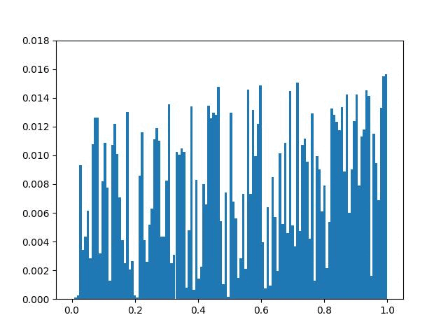

# MAT1510 Final Project
In this repository, I include the source code for my presentation and report as a Jupyter notebook, as well as the presentation and report PDFs, and a GIF showcasing the results of my experiment, which I felt were difficult to convey in a PDF format. 

   
   
  <b> Transforming a randomly generated measure into a specific target measure using the WROF formulation of Tristan Milne's TTC algorithm. </b>

Please note that the slides are currently outdated -- in particular, at the time of the slideshow I was mistakenly using the iterative scheme
$$\rho_{n+1}\in\text{argmin}\_{\mathcal{P}(\mathbb{R}^n)}
\left[\frac{1}{2\tau}d_1^2(\rho_n,\rho)+d_{1/2}(\rho,\nu)\right],$$
instead of the correct scheme
$$\rho_{n+1}\in\text{argmin}\_{\mathcal{P}(\mathbb{R}^n)}\left[\frac{1}{2\tau}d_2^2(\rho_n,\rho)+d_{1}(\rho,\nu)\right].$$
This mistake has been corrected for the final report, which resulted in much better results. 
